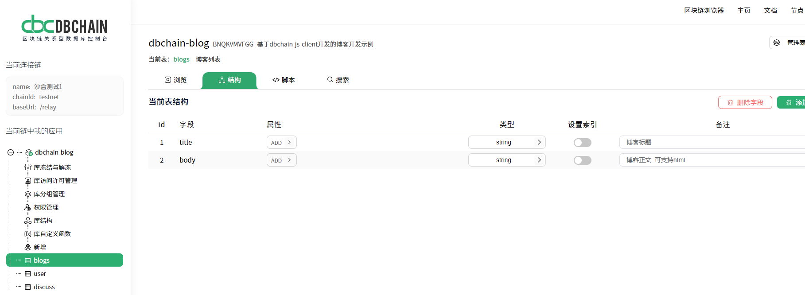

[中文](https://github.com/dbchaincloud/android-client/blob/master/README_ch.md)

# dbChain android-client

---

dbChain android-client is the Android implementation of the client side library of dbChain, the blockchain database. With the android-client, developers can quickly start a dbChain application in minutes.

The android-client provides Android functions for

- Randomly generate DBChainKey (including mnemonic words and key pairs)
- Import mnemonic words to generate DBChainKey
- Check whether the mnemonic phrase is legal
- Request a token, get the number of tokens
- Insert a row of data into the table
- Freeze a row of data in the table
- Get all rows in the table that have access permissions
- Searching for rows contain certain field value
- Package the message (put multiple operations in one transaction)

## Quick Setup

### 1. Add the JitPack repository to your build file
```groovy
allprojects {
    repositories {
        ...
        maven { url 'https://jitpack.io' }
    }
}
```
### 2. Add dependency in Module
```groovy
dependencies {
    implementation 'com.github.dbchaincloud:android-client:1.0.0'
}
```
### 3. Add the bip39-wordlist.txt file to the Module that verifies whether the mnemonic words are legal

### 4. Initialize DBChain in Application
```kotlin
// After creating the database in the console, get appCode, baseUrl, chainId
val appCode = "Your AppCode"
val baseUrl = "Your BaseUrl"
val chainId = "Your ChainId"
val debug = BuildConfig.DEBUG
DBChain.init(this, appCode, baseUrl, chainId, debug)
```
### 5. Add network permissions  

### 6. After obtaining the DBChainKey, initialize it to the library
```kotlin
DBChain.withDBChainKey(dbChainKey)
```

## Usage

### Randomly generate DBChainKey (including mnemonic words and key pairs)
```kotlin
val dbChainKey = MnemonicClient.generateMnemonic()
```

### Import mnemonic words to generate DBChainKey
```kotlin
val list = listOf(
        "tooth",
        "source",
        "tiny",
        "frost",
        "biology",
        "island",
        "tent",
        "alien",
        "sure",
        "easily",
        "fancy",
        "roast"
    )
val dbChainKey = MnemonicClient.importMnemonic(list)
```

### Check whether the mnemonic phrase is legal
```kotlin
val check = MnemonicClient.checkMnemonic(mnemonic)
```

### Request a token
```kotlin
val requestAppUser = requestAppUser()
// After success, you need to wait a few seconds for the tokens to be credited
val result = requestAppUser.isSuccess
```

### Get the number of tokens
```kotlin
val tokenAmount = getToken(address)
```

### Suppose a table is created in the console: blogs
 

### Insert a row of data into the table
```kotlin
val title = "My favorite language"
val body = "I like java"
val map = hashMapOf("title" to title, "body" to body)
insertRow("blogs",map)
```

### Freeze a row of data in the table
```kotlin
// Freeze a row of data with id 1 in the blogs table
freezeRow("blogs", "1")
```

### Get all rows in the table that have access permissions
```kotlin
val tableName = "blogs"
val queriedArray = QueriedArray(table = tableName)
querier(queriedArray)
```

### Searching for rows contain certain field value
#### 1. Query line according to id
```kotlin
val tableName = "blogs"
val queriedArray = QueriedArray(table = tableName).findById("3")
querier(queriedArray)
```
#### 2. Query line according to title
```kotlin
val tableName = "blogs"
val queriedArray = QueriedArray(table = tableName).findEqual("title","My favorite language")
querier(queriedArray)
```

### Package the message (put multiple operations in one transaction)
```kotlin
// This example packs 3 operations into one transaction, either all succeed or all fail
// Two rows of data are inserted, and a row of data with id 2 is frozen
val tableName = "blogs"
val messageList = newMessageList().apply {
    add(createInsertMessage(tableName, mapOf("title" to "First blog", "body" to "First blog body")))
    add(createInsertMessage(tableName, mapOf("title" to "Second blog", "body" to "Second blog body")))
    add(createFreezeMessage(tableName, "2"))
}
handleBatchMessage(messageList)
```
